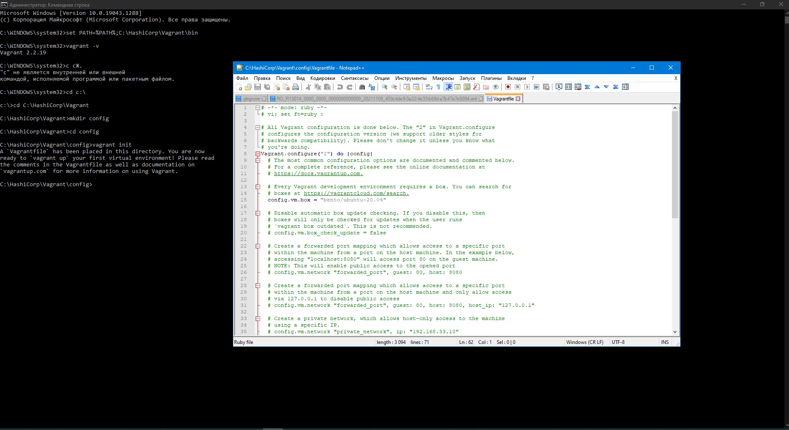

# 03-sysadmin-01-terminal
1. Установите средство виртуализации Oracle VirtualBox.  
Ну тут легко. Ставлю VB на Win 10  
---
2. Установите средство автоматизации Hashicorp Vagrant.  
Тоже не сложно. Ставлю, ребутаю комп  
---
3. Виндовый терминал устраивает, проблем с переменными не возникло.  
---
4. Microsoft Windows [Version 10.0.19043.1288]  
(c) Корпорация Майкрософт (Microsoft Corporation). Все права защищены.  
  
C:\WINDOWS\system32>set PATH=%PATH%;C:\HashiCorp\Vagrant\bin  
  
C:\WINDOWS\system32>vagrant -v  
Vagrant 2.2.19  
  
C:\WINDOWS\system32>с сЖ.  
"с" не является внутренней или внешней  
командой, исполняемой программой или пакетным файлом.  
  
C:\WINDOWS\system32>cd c:\  
c:\>cd C:\HashiCorp\Vagrant  
C:\HashiCorp\Vagrant>mkdir config  
C:\HashiCorp\Vagrant>cd config  
Правим config в notepad  
  
C:\HashiCorp\Vagrant\config>vagrant init  
A `Vagrantfile` has been placed in this directory. You are now  
ready to `vagrant up` your first virtual environment! Please read  
the comments in the Vagrantfile as well as documentation on  
`vagrantup.com` for more information on using Vagrant.  

C:\HashiCorp\Vagrant\config>vagrant up  
Bringing machine 'default' up with 'virtualbox' provider...  
==> default: Box 'bento/ubuntu-20.04' could not be found. Attempting to find and install...  
    default: Box Provider: virtualbox  
    default: Box Version: >= 0  
==> default: Loading metadata for box 'bento/ubuntu-20.04'  
    default: URL: https://vagrantcloud.com/bento/ubuntu-20.04  
==> default: Adding box 'bento/ubuntu-20.04' (v202107.28.0) for provider: virtualbox  
    default: Downloading: https://vagrantcloud.com/bento/boxes/ubuntu-20.04/versions/202107.28.0/providers/virtualbox.box  
    default:  
==> default: Successfully added box 'bento/ubuntu-20.04' (v202107.28.0) for 'virtualbox'!  
==> default: Importing base box 'bento/ubuntu-20.04'...  
==> default: Matching MAC address for NAT networking...  
==> default: Checking if box 'bento/ubuntu-20.04' version '202107.28.0' is up to date...  
==> default: Setting the name of the VM: config_default_1636693586323_82730  
Vagrant is currently configured to create VirtualBox synced folders with  
the `SharedFoldersEnableSymlinksCreate` option enabled. If the Vagrant  
guest is not trusted, you may want to disable this option. For more  
information on this option, please refer to the VirtualBox manual:  

  https://www.virtualbox.org/manual/ch04.html#sharedfolders  

This option can be disabled globally with an environment variable:  
  
  VAGRANT_DISABLE_VBOXSYMLINKCREATE=1  

or on a per folder basis within the Vagrantfile:  
  
  config.vm.synced_folder '/host/path', '/guest/path', SharedFoldersEnableSymlinksCreate: false  
==> default: Clearing any previously set network interfaces...  
==> default: Preparing network interfaces based on configuration...  
    default: Adapter 1: nat  
==> default: Forwarding ports...  
    default: 22 (guest) => 2222 (host) (adapter 1)  
==> default: Booting VM...  
There was an error while executing `VBoxManage`, a CLI used by Vagrant  
for controlling VirtualBox. The command and stderr is shown below.  

Command: ["startvm", "fd26c3ed-069a-4942-bd9f-fa16290bf49f", "--type", "headless"]  

Stderr: VBoxManage.exe: error: Call to WHvSetupPartition failed: ERROR_SUCCESS (Last=0xc000000d/87) (VERR_NEM_VM_CREATE_FAILED)  
VBoxManage.exe: error: Details: code E_FAIL (0x80004005), component ConsoleWrap, interface IConsole  

C:\HashiCorp\Vagrant\config>  

После нескольких танцев с бубном ВМ запустилась:  

C:\HashiCorp\Vagrant\config>vagrant up  
Bringing machine 'default' up with 'virtualbox' provider...  
==> default: Checking if box 'bento/ubuntu-20.04' version '202107.28.0' is up to date...  
==> default: Clearing any previously set forwarded ports...  
==> default: Clearing any previously set network interfaces...  
==> default: Preparing network interfaces based on configuration...  
    default: Adapter 1: nat  
==> default: Forwarding ports...  
    default: 22 (guest) => 2222 (host) (adapter 1)  
==> default: Booting VM...  
==> default: Waiting for machine to boot. This may take a few minutes...  
    default: SSH address: 127.0.0.1:2222  
    default: SSH username: vagrant  
    default: SSH auth method: private key  
    default:  
    default: Vagrant insecure key detected. Vagrant will automatically replace  
    default: this with a newly generated keypair for better security.  
    default:  
    default: Inserting generated public key within guest...  
    default: Removing insecure key from the guest if it's present...  
    default: Key inserted! Disconnecting and reconnecting using new SSH key...  
==> default: Machine booted and ready!  
==> default: Checking for guest additions in VM...  
    default: The guest additions on this VM do not match the installed version of  
    default: VirtualBox! In most cases this is fine, but in rare cases it can  
    default: prevent things such as shared folders from working properly. If you see  
    default: shared folder errors, please make sure the guest additions within the  
    default: virtual machine match the version of VirtualBox you have installed on  
    default: your host and reload your VM.  
    default:  
    default: Guest Additions Version: 6.1.24  
    default: VirtualBox Version: 6.0  
==> default: Mounting shared folders...  
    default: /vagrant => C:/HashiCorp/Vagrant/config  
    
---
	
5. Ознакомьтесь с графическим интерфейсом VirtualBox, посмотрите как выглядит виртуальная машина,  
которую создал для вас Vagrant, какие аппаратные ресурсы ей выделены. Какие ресурсы выделены по-умолчанию?  

По умолчанию выделено 1Гб ОЗУ, 64Гб на диске и 2 процессора. Обычный интерфейс VBox. Настройки машины лежат в  
C:\Users\y.kozlov\VirtualBox VMs\config_default_1636697568053_67486 (в моём случае это путь по умолчанию)  
  
---
6.  Ознакомьтесь с возможностями конфигурации VirtualBox через Vagrantfile: документация. Как добавить оперативной памяти  
или ресурсов процессора виртуальной машине?  

Удобно изменить пареметры машины по умолчанию можно с помощью добавления параметров файл Vagrantfile  
config.vm.provider "virtualbox" do |v|  
  v.memory = 4000  
  v.cpus = 8  
  v.gui = true  
  end  
 

 
 

